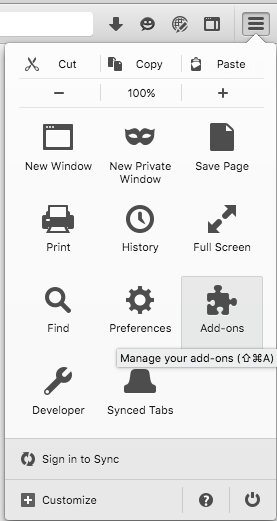
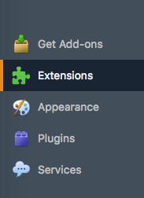
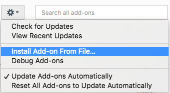
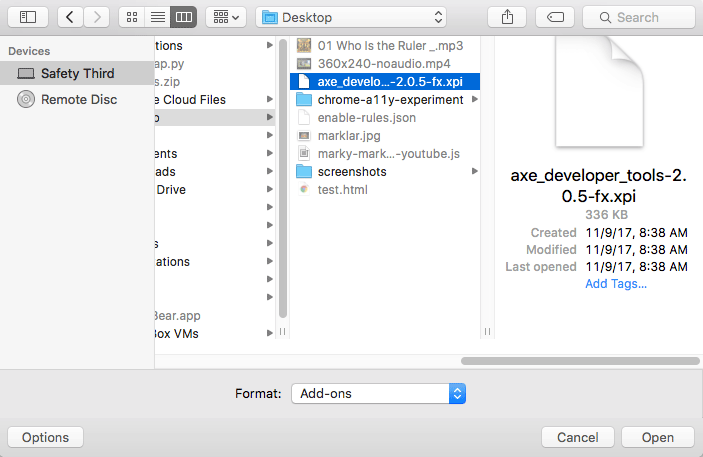
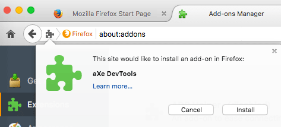

For users of ESR and legacy Firefox browsers (<= version 53), we’re providing our <a href="../assets/addons/axe_developer_tools-2.0.5-fx.xpi">signed aXe addon for download (.xpi)</a>.

## Install instructions

- Download the xpi file to a location on your computer you can easily find again
- Open Firefox 53 or lower
- Go to Tools > Addons, or Menu > Addons
- Go to Extensions
- Open the gear menu, and select "Install add-on from file"
- Navigate to the xpi on your file system, and install it
- Accept the addon install
- Open the developer tools and navigate to the "Accessibility" tab

### In pictures

#### Manage Addons:

#### Navigate to extensions page:

#### Gears icon with "Install add-on from file":

#### Find file on system file dialog:

#### Allow the extension:

